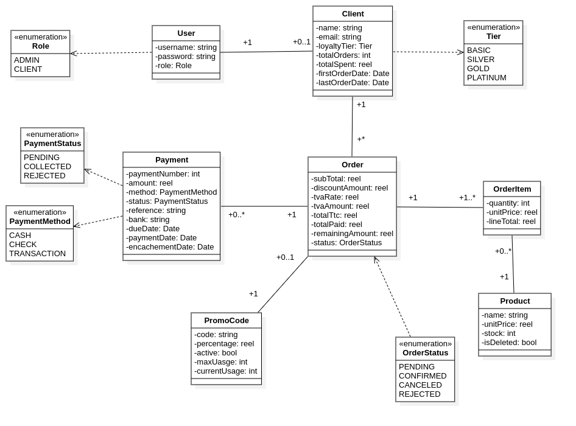

# SmartShop Backend

SmartShop is a Spring Boot backend that powers a commercial management platform. It handles order processing, loyalty pricing, promo codes, stock management, and payments while exposing a REST API for administrative clients.

## Table of Contents
1. [Features](#features)
2. [Architecture](#architecture)
3. [Tech Stack](#tech-stack)
4. [Local Development](#local-development)
   - [Prerequisites](#prerequisites)
   - [Environment Variables](#environment-variables)
   - [Run with Maven](#run-with-maven)
   - [Run with Docker Compose](#run-with-docker-compose)
5. [Database Schema Highlights](#database-schema-highlights)
6. [Business Rules](#business-rules)
7. [API Overview](#api-overview)
8. [Testing](#testing)
9. [Project Structure](#project-structure)
10. [Class Diagram & Links](#class-diagram-links)

## Features
- **Order lifecycle**: create, confirm, cancel orders with server-side pricing and loyalty tier integration.
- **Pricing engine**: calculates subtotal, stacked loyalty & promo discounts, TVA, and totals.
- **Promo code management**: validation, usage tracking, and automatic decrement on order confirmation.
- **Stock management**: decrements only on confirmation, restores on cancellation.
- **Payment tracking**: record payments, update statuses, and enforce paid-in-full requirement before confirmation.
- **Loyalty tiers**: BASIC → SILVER → GOLD → PLATINUM, auto-updated based on order history.
- **Authentication & authorization**: session-based auth with role annotations (`@Authenticated`, `@HasRole`).
- **Soft deletes**: Entities such as `Client`, `Product`, and the linked `User` support soft deletion.
- **Seed data**: Command line runners seed baseline clients and products for demos.

## Architecture
- **Hexagonal** layered approach: controllers → services → repositories → domain entities.
- **DTO mapping**: MapStruct handles entity ↔ DTO conversion.
- **Validation**: Jakarta Bean Validation on request DTOs.
- **Exception handling**: centralized `GlobalExceptionHandler` returns structured JSON errors.
- **Configuration**: Pricing, loyalty thresholds, and TVA rate via `PricingConfiguration` and services.

## Tech Stack
- Java 21
- Spring Boot 4 (Web MVC, Data JPA, Validation)
- MapStruct 1.6
- PostgreSQL 17 (via Docker Compose)
- Lombok, BCrypt, Springdoc OpenAPI
- JUnit + Mockito (service tests)

## Local Development

### Prerequisites
- Java 21
- Maven 3.9+
- Docker & Docker Compose (optional)

### Environment Variables
Create a `.env` file at the project root:
```env
DB_NAME=smartshop
DB_USER=smartshop
DB_PASSWORD=smartshop
SPRING_DATASOURCE_URL=jdbc:postgresql://db:5432/${DB_NAME}
SPRING_DATASOURCE_USERNAME=${DB_USER}
SPRING_DATASOURCE_PASSWORD=${DB_PASSWORD}
SPRING_JPA_HIBERNATE_DDL_AUTO=update
```
When running without Docker, override the datasource host to `localhost`.

### Run with Maven
```bash
./mvnw spring-boot:run
```
The API will start on `http://localhost:8080`.

### Run with Docker Compose
```bash
docker compose up --build -d
```
This starts the API (`smartshop-api`) and PostgreSQL (`smartshop-db`). Logs:
```bash
docker compose logs -f
```
Shut down:
```bash
docker compose down -v
```

## Database Schema Highlights
- **users** ↔ **clients**: one-to-one with soft delete support and cascade persistence/merge.
- **orders** ↔ **order_items**: parent-child relation with per-item pricing snapshots.
- **payments**: linked to orders; status controls confirmation rules.
- **promo_codes**: fields for percentage, max usage, current usage, active flag.
- **products**: soft-deleted inventory with stock levels.

## Business Rules
1. Orders must have unique product items (duplicate IDs rejected).
2. Pricing is computed server-side; client cannot submit manual discount/TVA amounts.
3. Loyalty & promo discounts stack; TVA applied post-discount.
4. Stock is decremented on confirmation, restored on cancellation.
5. Orders require full payment (`remainingAmount == 0`) before confirmation.
6. Promo usage increments when an order using the code confirms.
7. Client stats update on confirmation; loyalty tier recalculated afterwards.

## API Overview
Explore interactive API docs once running:
```
GET http://localhost:8080/swagger-ui/index.html
```
Key endpoints:
- `/api/orders` – create, list, retrieve, confirm, cancel orders.
- `/api/orders/{id}/payments` – manage payments for an order.
- `/api/promo-codes` – CRUD promo codes, apply validations.
- `/api/products` – manage catalog and stock.
- `/api/clients` – manage customer records.

Role-based guardrails:
- Admin endpoints protected by `@HasRole(Role.ADMIN)`.
- Client self-service endpoints guard `@Authenticated` + `@HasRole(Role.CLIENT)`.

## Testing
Run unit tests:
```bash
./mvnw test
```
## Project Structure
```
src/
  main/
    java/com/kyojin/smartshop/
      controller/        # REST controllers
      core/              # Auth annotations, exception handling, seeders
      dto/               # Request/response DTOs
      entity/            # JPA entities
      mapper/            # MapStruct mappers
      repository/        # Spring Data repositories
      service/           # Service interfaces & implementations
      util/              # Utility helpers (e.g., PasswordUtil)
    resources/
      application.yml    # Spring configuration
  test/java/...          # Unit tests

Dockerfile                # Container build
Docker-compose.yml        # Local infra (API + Postgres)
```

## Class Diagram



## Links
- **Jira Link**: [JIRA](https://jadserghini.atlassian.net/jira/software/projects/SMAAR/boards/201/backlog?atlOrigin=eyJpIjoiOWY5YzZlMmQ1M2UyNGVhM2E4ZDljNjM4MmVmMjdkN2EiLCJwIjoiaiJ9)
- **Presentation**: [CANVA](https://www.canva.com/design/DAG69Jw7sYc/4gm5lDAPLj2qu04D05rLnw/edit?utm_content=DAG69Jw7sYc&utm_campaign=designshare&utm_medium=link2&utm_source=sharebutton)

